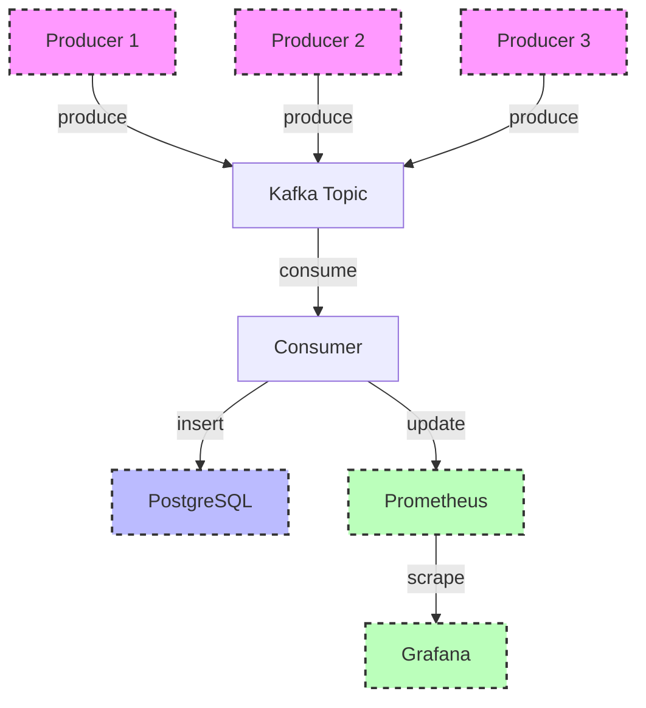

# Audit Log Service

## Description

Audit Log Service is a Go-based project designed to record and manage audit logs from various services. It utilizes Kafka for event processing and Prometheus for performance monitoring.

## Architecture



## Features

- Record audit events from multiple services.
- Process audit events through Kafka.
- Store audit data in PostgreSQL.
- Monitor performance with Prometheus and visualize with Grafana.

## Tech Stack

- **Go**: Main programming language.
- **Kafka**: Event processing.
- **PostgreSQL**: Data storage.
- **Prometheus**: Performance monitoring.
- **Grafana**: Monitoring visualization.

## Quick Start

1. **Clone the repository**:
   ```bash
   git clone https://github.com/yourusername/audit-log-service.git
   cd audit-log-service
   ```

2. **Start the services with Docker Compose**:
   ```bash
   docker compose up -d
   ```

3. **Run the application**:
   ```bash
   make run-app
   ```

4. **Access the dashboards**:
   - **Grafana**: [http://localhost:3000](http://localhost:3000) (admin/admin)
   - **Prometheus**: [http://localhost:9090](http://localhost:9090)
   - **Kafka UI**: [http://localhost:8080](http://localhost:8080)

## Makefile Commands

- **Build the application**:
  ```bash
  make build
  ```

- **Run the main application**:
  ```bash
  make run-app
  ```

- **Run Kafka producers**:
  - User producer:
    ```bash
    make run-user-producer
    ```
  - Payment producer:
    ```bash
    make run-payment-producer
    ```

- **Run tests**:
  ```bash
  make test
  ```

- **Start all services**:
  ```bash
  make up
  ```

- **Stop all services**:
  ```bash
  make stop
  ```

- **Clean up build artifacts**:
  ```bash
  make clean
  ```

## Dashboards

- **Audit Overview**: Overview of audit events.
- **Performance Metrics**: System performance metrics.

## Services

### Core Services
- **auditlog-app**: Main application with HTTP server and Kafka consumer
- **auditlog-db**: PostgreSQL database
- **auditlog-kafka**: Kafka message broker
- **auditlog-zookeeper**: Kafka cluster coordination
- **auditlog-kafka-ui**: Kafka monitoring interface

### Producer Services
- **User Producer**: Simulates user-related audit events (login, logout, profile updates)
- **Payment Producer**: Simulates payment-related audit events (transactions, refunds)

## Quick Start

### 1. Start the Infrastructure

```bash
# Start all services (Kafka, PostgreSQL, Kafka UI)
make up

# Wait for services to be ready (about 30 seconds)
sleep 30
```

### 2. Run Database Migrations

```bash
make migrate
```

### 3. Start the Main Application

```bash
make run
```

The application will start on `http://localhost:8080` and begin consuming audit log messages from Kafka.

### 4. Start the Producers

```bash
# Start both producers
make run-producers

# Or start them individually
make run-user-producer
make run-payment-producer
```

### 5. Monitor with Kafka UI

Access Kafka UI at `http://localhost:8081` to monitor:
- Topics and partitions
- Message flow
- Consumer groups
- Message content

## API Endpoints

### Get Audit Logs
```bash
GET http://localhost:8080/api/v1/audit-logs
```

Query Parameters:
- `user_id`: Filter by user ID
- `action`: Filter by action type
- `resource`: Filter by resource type
- `from`: Start timestamp (ISO 8601)
- `to`: End timestamp (ISO 8601)
- `limit`: Number of records to return (default: 50)
- `offset`: Number of records to skip (default: 0)

Example:
```bash
curl "http://localhost:8080/api/v1/audit-logs?user_id=user_123&action=login&limit=10"
```

## Message Format

Audit log messages follow this JSON structure:

```json
{
  "id": "uuid-string",
  "user_id": "user_123",
  "action": "login",
  "resource": "user",
  "resource_id": "res_456",
  "details": {
    "ip_address": "192.168.1.100",
    "session_id": "session-uuid",
    "success": true
  },
  "ip_address": "192.168.1.100",
  "user_agent": "UserProducer/1.0",
  "timestamp": "2024-01-15T10:30:00Z",
  "service_name": "user-service"
}
```

## Configuration

### Environment Variables

Create a `.env` file with the following variables:

```env
# Database
DB_HOST=db
DB_USER=postgres
DB_PASSWORD=postgres
DB_NAME=auditlog
DB_PORT=5432

# Application
APP_PORT=8080
CORS_ALLOWED_ORIGINS=*

# Kafka
KAFKA_BROKERS=kafka:29092
```

### Producer Configuration

Producers support command-line flags:

```bash
# User producer with custom settings
go run cmd/producer-user/main.go \
  --brokers=localhost:9092 \
  --interval=2s \
  --count=100

# Payment producer with custom settings
go run cmd/producer-payment/main.go \
  --brokers=localhost:9092 \
  --interval=1s \
  --count=50
```

## Development

### Building

```bash
# Build main application
make build

# Build producers
make build-producers
```

### Testing

```bash
# Run all tests
make test

# Generate mocks
make mocks
```

### Database Operations

```bash
# Run migrations
make migrate

# Drop all tables
make drop

# Redo migrations (drop + migrate)
make redo
```

## Monitoring

### Kafka UI
- URL: `http://localhost:8081`
- Monitor topics, partitions, and consumer groups
- View message content and flow

### Application Logs
```bash
# View application logs
docker logs auditlog-app

# View producer logs
docker logs auditlog-user-producer
docker logs auditlog-payment-producer
```

### Database
```bash
# Connect to PostgreSQL
docker exec -it auditlog-db psql -U postgres -d auditlog

# View audit logs
SELECT * FROM audit_logs ORDER BY timestamp DESC LIMIT 10;
```

## Troubleshooting

### Common Issues

1. **Kafka connection errors**: Ensure Zookeeper and Kafka are fully started
2. **Database connection errors**: Check if PostgreSQL is ready
3. **Producer not sending messages**: Verify Kafka brokers are accessible

### Health Checks

```bash
# Check if all services are running
docker compose ps

# Check Kafka topic
docker exec auditlog-kafka kafka-topics --list --bootstrap-server localhost:9092

# Check consumer group
docker exec auditlog-kafka kafka-consumer-groups --list --bootstrap-server localhost:9092
```

## Stopping Services

```bash
# Stop producers
make stop-producers

# Stop all services
make teardown
```

## Architecture Diagram

```
┌─────────────────┐    ┌─────────────────┐    ┌─────────────────┐
│   User Producer │    │ Payment Producer│    │  Other Services │
└─────────┬───────┘    └─────────┬───────┘    └─────────┬───────┘
          │                      │                      │
          └──────────────────────┼──────────────────────┘
                                 │
                    ┌─────────────▼─────────────┐
                    │        Kafka Topic        │
                    │     (audit-logs)          │
                    └─────────────┬─────────────┘
                                  │
                    ┌─────────────▼─────────────┐
                    │   Audit Log Service       │
                    │   (Kafka Consumer)        │
                    └─────────────┬─────────────┘
                                  │
                    ┌─────────────▼─────────────┐
                    │     PostgreSQL DB         │
                    └───────────────────────────┘
```

## Contributing

1. Follow the existing code structure
2. Add tests for new features
3. Update documentation
4. Ensure all tests pass before submitting

## License

This project is licensed under the MIT License. 